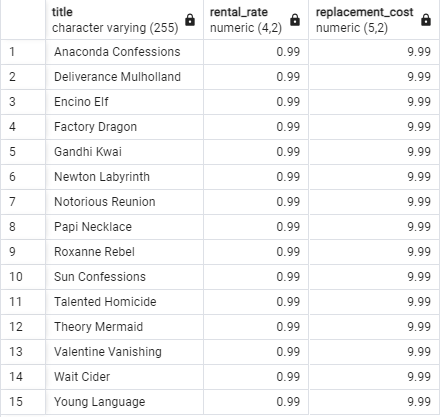
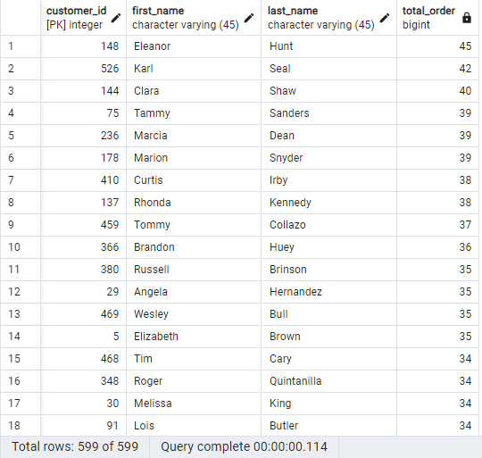

1. SELECT COUNT(*) FROM film
   WHERE length > 
   (
 	 SELECT AVG(length) FROM film
   );

   

2. SELECT COUNT(*) FROM film
   WHERE rental_rate = 
   (
 	 SELECT MAX(rental_rate) FROM film
   );

   

3. SELECT title, rental_rate, replacement_cost FROM film
   WHERE (rental_rate = (SELECT MIN(rental_rate) FROM film) AND replacement_cost = (SELECT MIN(replacement_cost) FROM film));

   

4. SELECT
    customer.customer_id,
    customer.first_name,
    customer.last_name,
    COUNT(payment.payment_id) AS total_order
   FROM
    customer
   INNER JOIN
    payment ON customer.customer_id = payment.customer_id
   GROUP BY
    customer.customer_id, customer.first_name, customer.last_name
   ORDER BY
    total_order DESC;

    